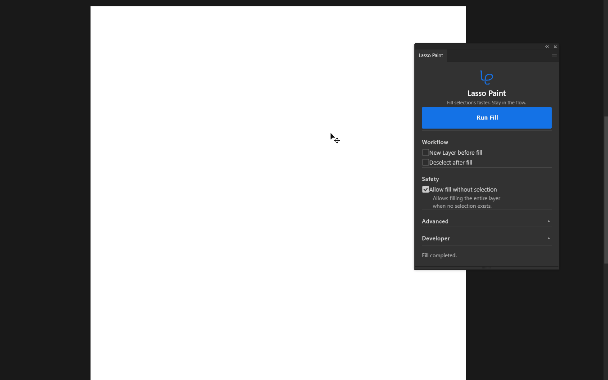
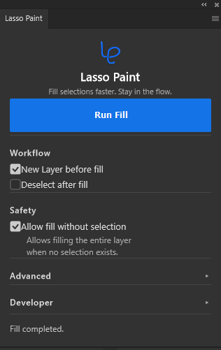

  

<h1 align="center">Lasso Paint</h1>

<strong>Fill selections faster. Stay in the flow.</strong>

A lightweight Adobe Photoshop UXP plugin that streamlines selection fill and erase workflows.

  

## Why Lasso Paint?

Repetitive Photoshop actions interrupt creative flow.

Lasso Paint combines repetitive fill, erase, layer, and deselect steps into fast automatic actions while staying lightweight, native, and focused on the selection workflow.

No complicated setup.

No unnecessary features.

Just a faster selection workflow.

## Features

### Automatic Fill

Fill new selections with the foreground color as soon as they are created.

### Auto Mode

Choose Fill, Erase, or OFF for the current drawing flow.

### New Layer before Fill

Create a new layer before filling without leaving the panel.

### Deselect after Action

Clear the active selection automatically after a fill or erase completes.

### Selection Guard

Skip actions when no active selection can be confirmed.

### Fill Opacity

Choose fill opacity in 20% steps from 20 to 100.

### Fill Presets

Switch quickly between Base, Shadow, Highlight, and Overlay fill settings.

### Blend Mode

Choose Normal, Multiply, Screen, or Overlay when filling selections.

### Collapsible Fill Controls

Keep opacity and blend settings tucked away until you need them.

### Spring-loaded Eyedropper Workflow

Use Photoshop's spring-loaded **I** shortcut to sample colors without leaving the Lasso flow.

### Native Photoshop Experience

Work from a lightweight UXP panel that fits naturally into Photoshop.

## Screenshots

### Main Panel

  

The main panel keeps Auto Mode, presets, fill controls, and workflow toggles close at hand.

## Installation

### Recommended

1. Download the latest `.ccx` package from GitHub Releases.
2. Open the `.ccx` file.
3. Install Lasso Paint through Creative Cloud Desktop.
4. Open Photoshop.
5. Open **Plugins > Lasso Paint**.

### Developer Install

1. Install Adobe UXP Developer Tool.
2. Clone or download the repository.
3. Open UXP Developer Tool.
4. Select **Add Plugin**.
5. Select the folder containing `manifest.json`.
6. Load the plugin.

## Usage

1. Choose **Fill**, **Erase**, or **OFF**.
2. Create a selection.
3. Lasso Paint runs the selected action automatically.
4. Continue drawing.

Optional settings:

- **Fill** fills new selections with the foreground color.
- **Erase** clears new selections to transparency.
- **OFF** disables automatic actions.
- **Preset** applies common fill settings for base color, shadow, highlight, and overlay work.
- **Opacity** controls fill strength in 20% steps.
- **Blend Mode** switches fill behavior between Normal, Multiply, Screen, and Overlay.
- **Opacity / Blend** can be collapsed for a cleaner daily drawing panel.
- **New Layer before Fill** creates a new layer before filling in Fill mode.
- **Deselect after Action** clears the selection after filling or erasing.

Presets, opacity, and blend mode affect Fill only. Erase always clears pixels to transparency.

When no active selection is found, Lasso Paint skips the workflow and leaves the layer unchanged.

## Color Picking Workflow

Use Photoshop's spring-loaded tool shortcuts to sample color without leaving the Lasso workflow.

1. Keep the Lasso tool active.
2. Hold **I** to temporarily switch to the Eyedropper tool.
3. Pick a foreground color on the canvas.
4. Release **I** to return to the Lasso tool.
5. Continue selecting and filling with Lasso Paint.

For pen workflows, assigning **I** to a pen button can make color picking faster while keeping the canvas-focused flow.

## Roadmap

### Current

- Stable fill workflow
- Auto Mode
- Fill Presets
- Opacity and Blend controls
- Native Photoshop UI
- Selection Guard
- Modern dark UI

### Coming Next

- Performance improvements
- Additional productivity tools

## Why UXP?

Lasso Paint is built with Adobe's modern UXP framework, so it integrates naturally into Photoshop as a native plugin panel.

## Contributing

Issues, feature requests, and Pull Requests are welcome.

Feedback helps shape a faster, cleaner Photoshop fill workflow.

## License

MIT License.
