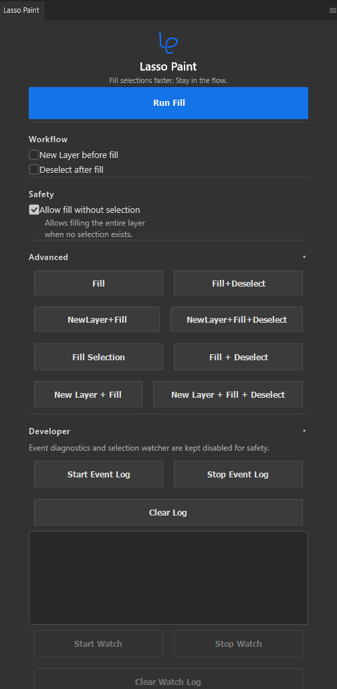

  

<h1 align="center">Lasso Paint</h1>

<strong>Fill selections faster. Stay in the flow.</strong>

A lightweight Adobe Photoshop UXP plugin that streamlines the selection fill workflow.

  

## Why Lasso Paint?

Repetitive Photoshop actions interrupt creative flow.

Lasso Paint combines common fill steps into one click while staying lightweight, native, and focused on the selection workflow.

No complicated setup.

No unnecessary features.

Just a faster fill workflow.

## Features

### One-click Fill

Fill the current selection with one focused command.

### New Layer before Fill

Create a new layer before filling without leaving the panel.

### Deselect after Fill

Clear the active selection automatically after the fill completes.

### Safe Fill Mode

Keep full-layer fills behind an explicit safety setting.

### Advanced Quick Commands

Run common fill, layer, and deselect combinations from compact shortcuts.

### Native Photoshop Experience

Work from a lightweight UXP panel that fits naturally into Photoshop.

## Screenshots

### Main Panel

  

The main panel keeps the everyday fill workflow close at hand.

### Advanced Panel

  

The advanced panel provides quick commands for repeated fill actions.

## Installation

1. Install Adobe UXP Developer Tool.
2. Clone or download the repository.
3. Open UXP Developer Tool.
4. Select **Add Plugin**.
5. Select the folder containing `manifest.json`.
6. Load the plugin.

## Usage

1. Create a selection.
2. Click **Run Fill**.
3. Continue drawing.

Optional settings:

- **New Layer before Fill** creates a new layer before filling.
- **Deselect after Fill** clears the selection after filling.
- **Allow fill without selection** permits a fill when no active selection exists.

## Safety

**Allow fill without selection** may fill the entire active layer.

It is disabled by default.

## Roadmap

### Current

- Stable fill workflow
- Native Photoshop UI
- Advanced Quick Commands
- Safe Fill Mode
- Modern dark UI

### Coming Next

- Auto Fill research
- Workflow presets
- Performance improvements
- Additional productivity tools

## Why UXP?

Lasso Paint is built with Adobe's modern UXP framework, so it integrates naturally into Photoshop as a native plugin panel.

## Contributing

Issues, feature requests, and Pull Requests are welcome.

Feedback helps shape a faster, cleaner Photoshop fill workflow.

## License

MIT License.
